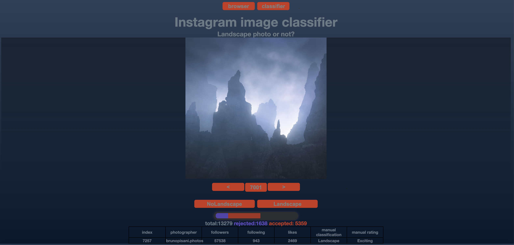

# IgScrapper

version 0.3

An Instagram scrapper, intended to generate training-data for downstream Machine Learning and Deep Learning applications. 

Downloads jpgs as well as metadata of this post.

Note: I use this tool to scrap a particular picture style (Landscape photography). This is done by selecting the users in UserList.txt accordingly. Thus, you have to do some research to get users that post the style you are interested.
After the initial scrap, I do a confirmation on the dataset, to flag all the images that belong to the category that I am interested. 
This is done by the "Image Viewer/Tool".

# Components: 
*  **Picture/Metadata scrapper: main.py**
* **Image Viewer/Tool to manually classify into  [Landscape / NoLandscape]** 

----------------------------
# Picture/Metadata scrapper: 
# Input: 
    
    UserList.txt: a text file with usernames of Instagram profiles.
    e.g. for the profile : https://www.instagram.com/sony/?hl=en, the username would be /sony/  
    format of textfile:   
    /username1/  
    /username2/  
    /username3/  
    ...  
 
  
    
 # How to run:
 get a geckodriver and a chromedriver into your repo folder  
 set your repo folder as homePath (in main.py)  
 create a database folder in your repo folder, and match it with the databaseFolder in main.py  
 create a UserList.txt in the repo folder (see format-information above) 
 run main.py: This will start a scrap run:   
 
        ##################################
        #HIGH LEVEL
        ##################################
        #while not EndConditionReached:
            # 0) check the status of the DB, and make a decision what to do, based on the status
                # if enough ulrs are in DB that are not downloaded, grab some of them to the DB
                # else, get new post urls into DB (using UserList.txt, a file with names of users to scrap)
            # 1) get list of posts from random user, from the DB
            # 2.1) download the image
            # 2.2) if image was saved get the metadata (likes etc, statistics of user) and write to DB
            # Do pause
        ##################################
To adjust the speed, change pauses at end of run.   
(pause('XL'), pause('L'), pause('M'), pause('S'), pause('XL'))  
To adjust length of scrap run, change maxRuntime instance variable of the ScrappApp class.  

 
 # Output:
 
 1. An SQlite database containing the metadata of all scrapped images
 
	* "photo_name" unique identifier, 
	* "photo_url" url of post, 
	* "likes" number of likes, 
	* "age" age of post in days, 
	* "downloaded" date when post was downloaded,
	* "IG_category" some posts are classified by instagram, in this case, they are saved, 
	* "hashtags" all hashtags of post, 
	* "photographer_name" Instagram username, 
	* "followers" number of followers of Instagram user, 
	* "following" number of users that this Instagram user is following, 
	* "manually_confirmed" auxiliary column to be used to manually clean the dataset, 
	* "is_downloaded" "True", if jpg has been saved, "False" if post still needs to be scrapped

2. jpgs of the users in UserList.txt. They will be placed in folders named by : username
     
     
# Requirements:
      instaloader
      selenium 
      sqlite3
      time
      random
      datetime
      os
      current version requires geckodriver and chromedriver in repo folder
  
----------------------------

# Image Viewer/ Classifier Tool:

A flask server reads images and metadata. This is sent to a HTML frontend.

**start server.py to launch the Viewer/Classifier Tool.**

The browser route lets you view images.
The classifier route lets you view images, plus lets you choose two features: 
manual classification: [Landscape / NoLandscape] 
manual rating: [Exciting / NonExciting]

# NAVIGATION:

**left / right arrow key:** choose prior / next image

**up / down arrow key:** choose Landscape /  NoLandscape

**1 / 2 key:** choose Exciting / NonExciting

 
